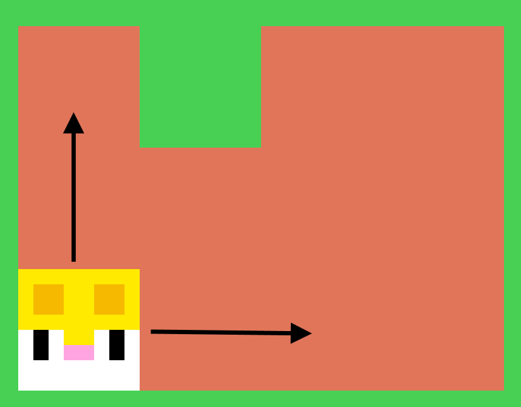
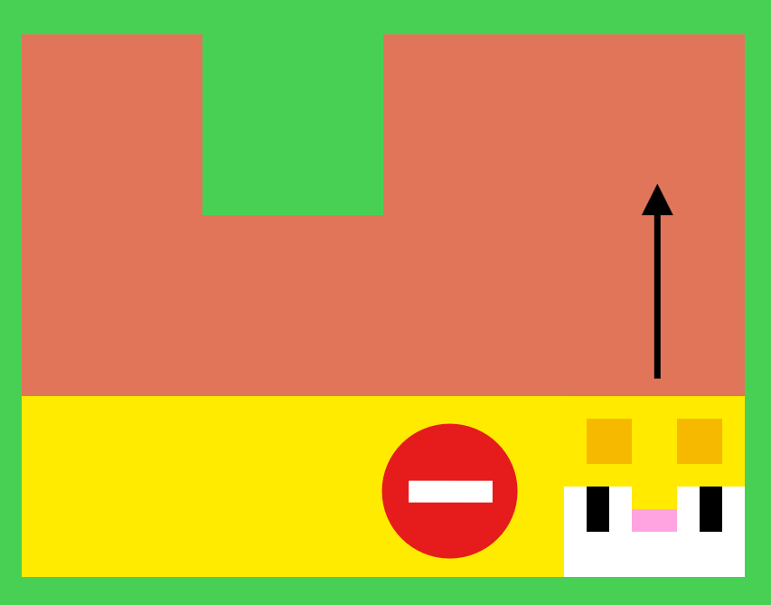
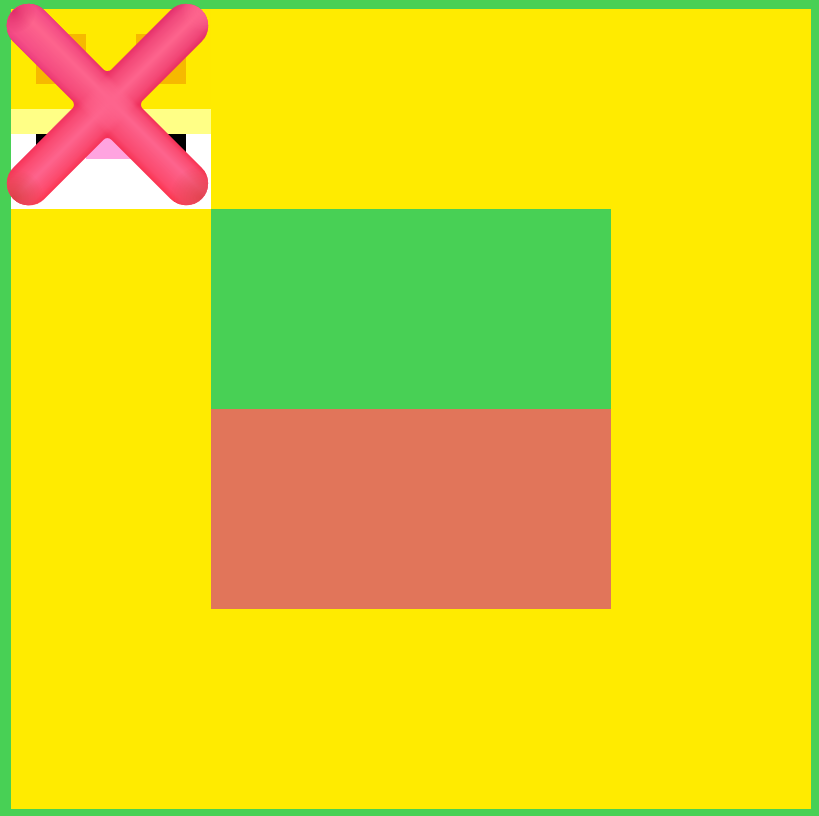
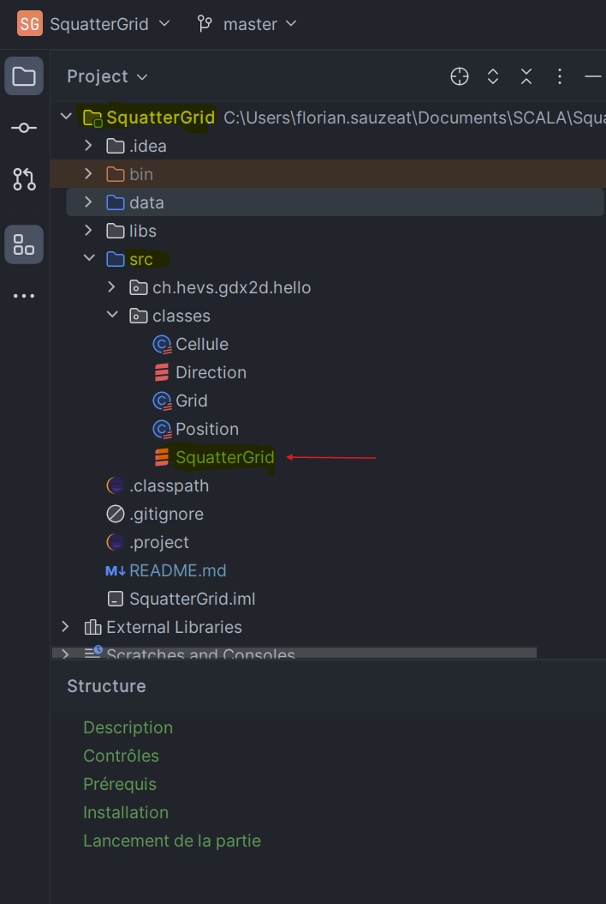
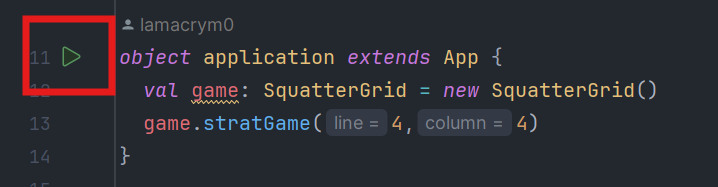

# SquatterGrid

## Description
"SquatterGrid" est un jeu développé en Scala où le joueur doit déplacer un Squatter dans une grille. 
Le Squatter peut se déplacer uniquement de manière verticale ou horizontale, sans pouvoir revenir sur ses pas. 
L'objectif est de remplir toute la grille avec les déplacements du Squatter. 
La partie s'arrête lorsque le Squatter ne peut plus choisir de direction.

## Contrôles
- Utilisez les touches directionnelles pour déplacer le Squatter dans la grille.
- Appuyez sur la touche espace pour indiquer que le Squatter ne peut plus avancer.
- La touche 'a' permet au joueur de déplacer le Squatter d'un coup dans les traces de la solution. 
Cette touche est désactivée si le joueur n'est pas déjà dans le chemin de la solution.
- La touche 's' permet d'afficher sur la gauche de la fenêtre la solution, en suivant le chemin indiqué du chiffre le plus petit vers le plus grand 
(la solution commence depuis le départ avec le nombre 1).

## Prérequis
- Scala

## Installation
- Clonez ce dépôt sur votre machine : [SquatterGrid Repository](https://github.com/lamacrym0/SquatterGrid.git)

## Lancement de la partie
- Cliquez sur le fichier suivant : SquatterGrid/src/classes/SquatterGrid
  

- Accédez à la méthode main et lancez le jeu.

- Pour quitter, fermez la fenêtre.

## Vidéo démo 

[Vidéo_de_présentation.mp4](Vid%E9o_de_pr%E9sentation.mp4)

